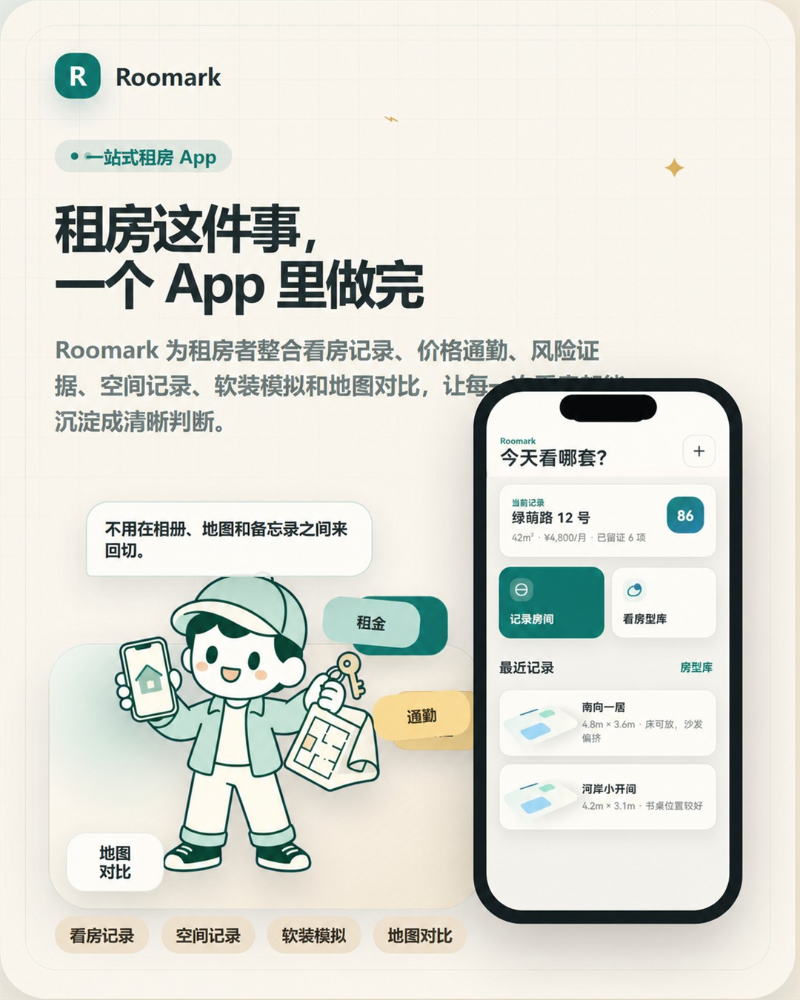
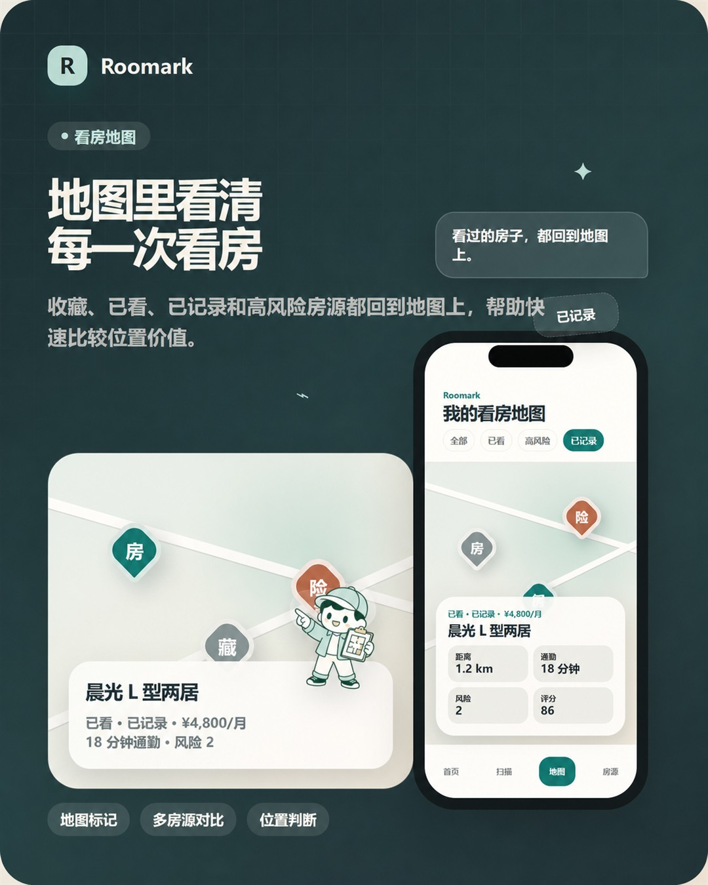
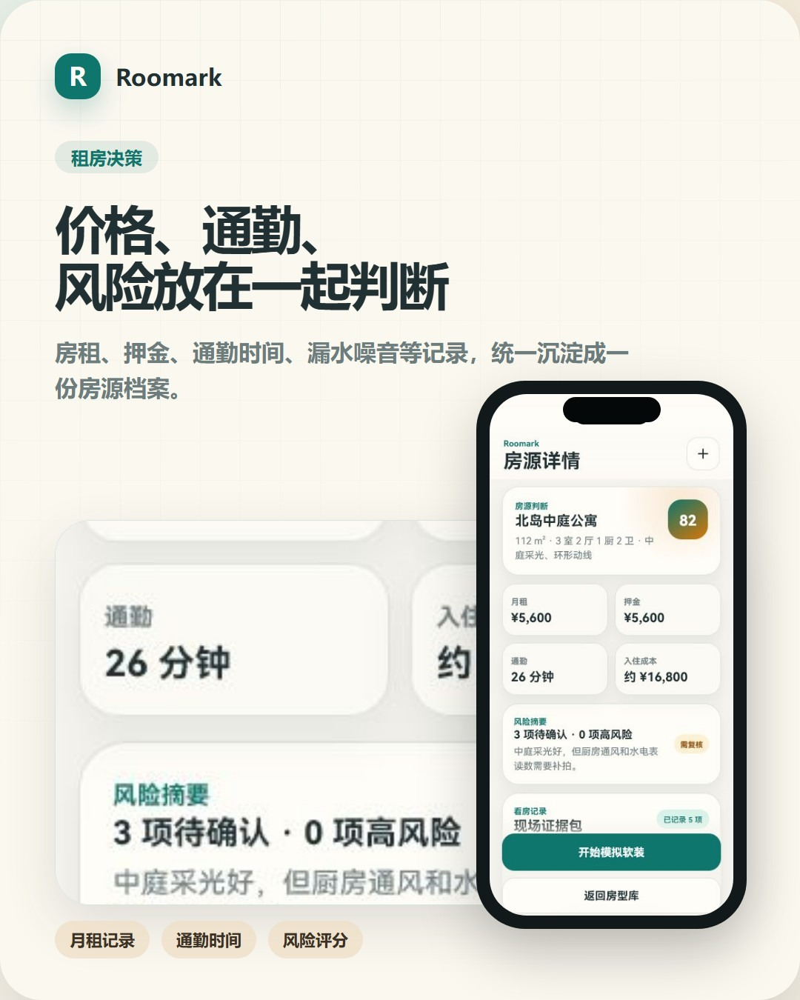
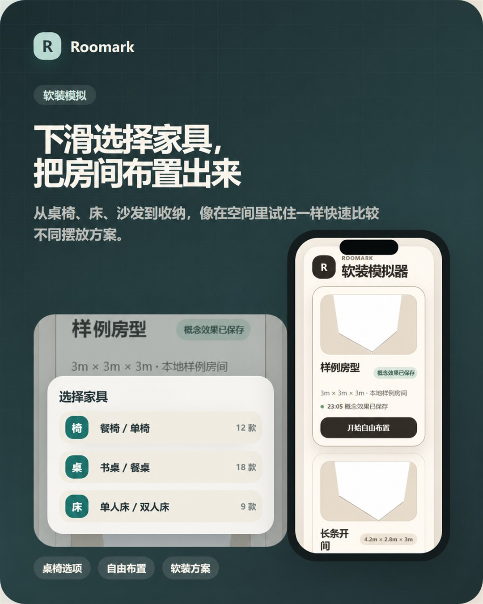

# Roomark

[中文](README.md) · [Product website](https://asaseal.github.io/roomark/) · [Contributing](CONTRIBUTING.md) · [Security](SECURITY.md)

Roomark is an Android-first, local-first rental viewing tool. It keeps property notes, move-in costs, commute time, risk evidence, listing comparison, an offline map, and furnishing layouts in one recoverable workflow so renters can make decisions from complete records after leaving a property.

## Product gallery

The public gallery and product website share the same capability-reviewed artwork, covering property records, map comparison, rental decisions, and spatial furnishing.

| Unified viewing records | Offline map comparison |
| --- | --- |
|  |  |

| Rental decision | Spatial furnishing |
| --- | --- |
|  |  |

## Current capabilities

- Property library, property details, and on-site issue records
- Rent, deposit, move-in cost, commute, and risk comparison
- Offline viewing map
- Clearly labelled simulated spatial capture and simplified floor-plan geometry
- WebView 3D furniture placement, dragging, locking, removal, and local persistence
- Concept-effect status write-back
- Corrupt-state recovery, retryable save failures, and serialized writes

## Capability boundaries

The Android application runs locally by default and does not require an account or server connection. The current release does not include accounts, cloud synchronization, social features, contract analysis, automatic 3D scanning, or a real image-generation service. Simulated spatial data and concept effects are labelled explicitly.

## Android quick start

Requirements: Node.js 20, JDK 17, Android SDK 34, and Android Studio or configured Android command-line tools.

```powershell
cd apps/mobile
npm.cmd ci
npm.cmd run verify
npm.cmd run android
```

Build a standalone release APK:

```powershell
cd apps/mobile/android
.\gradlew.bat assembleRelease
```

The APK is written to `apps/mobile/android/app/build/outputs/apk/release/app-release.apk`.

## Self-hosted backend

`services/backend` is the Rust service for Roomark’s existing scan-session, room-geometry, indoor-viewpoint, and furnishing-project domains. The Android application remains usable when the backend is not running.

```powershell
cargo run --manifest-path services/backend/Cargo.toml
```

See [services/backend/README.md](services/backend/README.md) for API, persistence, and container deployment details.

## Architecture

```text
apps/mobile        Primary Android product, local state, and 3D WebView
apps/web-preview   Browser fallback and product contract checks
apps/web-furnish   Standalone 3D furnishing workflow
apps/website       Static product website
services/backend   Self-hosted Rust service
proto/roomark/v1   Shared gRPC contract
docs/product       Product verification and release guidance
docs/technical     Architecture and deployment documentation
scripts            Unified verification and release packaging
```

## Verification

```powershell
npm.cmd --prefix apps/mobile run verify
node --test apps/web-preview/tests/*.test.cjs apps/web-furnish/tests/*.test.cjs apps/website/tests/*.test.cjs scripts/tests/*.test.cjs
cargo test --manifest-path services/backend/Cargo.toml
```

Android emulator evidence is recorded in [Roomark Android verification](docs/product/roomark-android-verification.md). A physical Android device remains a required gate before store publication.

## Contributing

Read [CONTRIBUTING.md](CONTRIBUTING.md) before submitting code. Use [SUPPORT.md](SUPPORT.md) for support routes and [SECURITY.md](SECURITY.md) for private vulnerability reporting.

## License

Roomark is available under the [MIT License](LICENSE).
